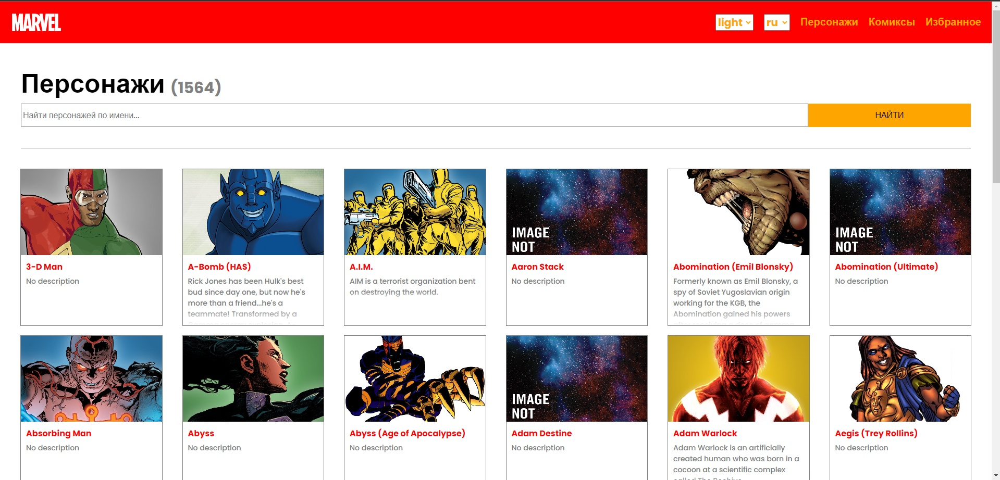
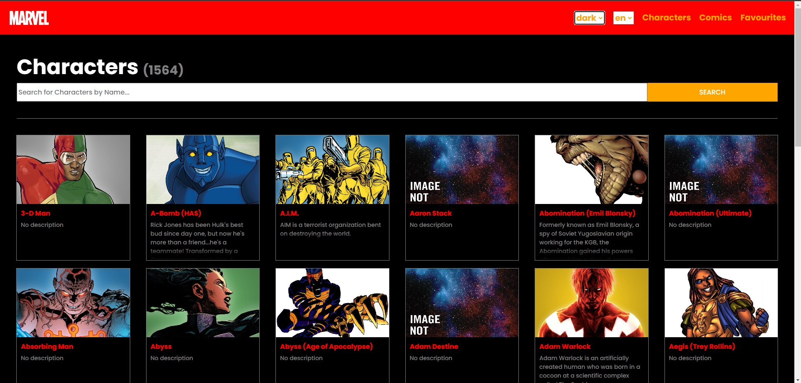
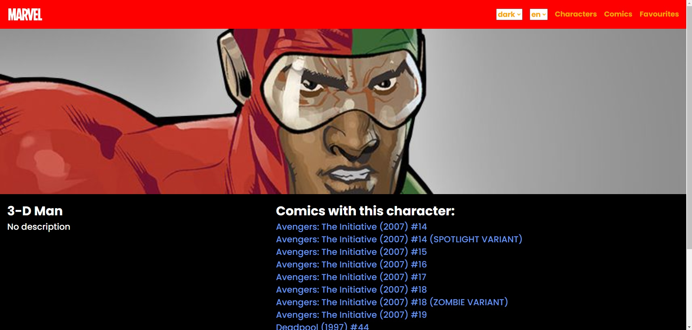
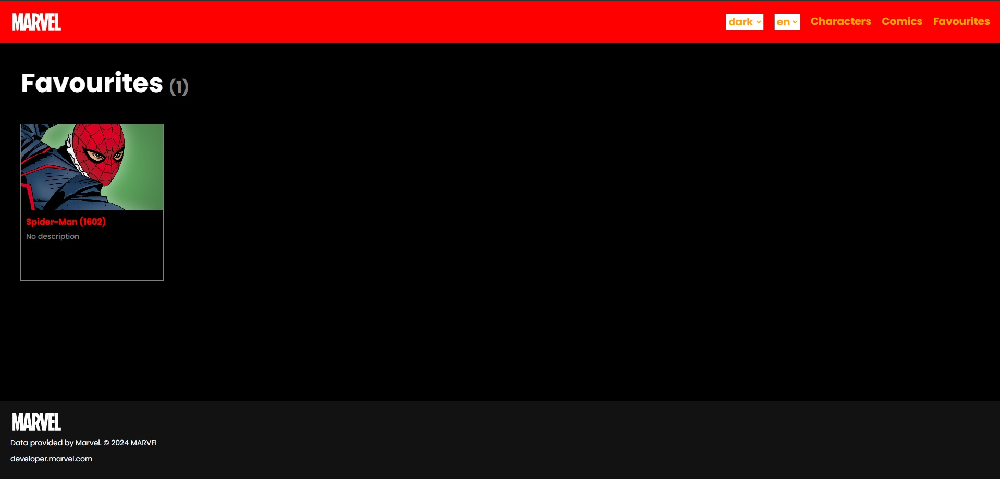

# Сайт с информацией о героях и комиксах MARVEL
___
## О сайте:
* ### Сайт представляет из себя библиотеку со всеми героями и комиксами вселенной MARVEL</h3>
* ### Информация о героях и комиках загружается с помощью MARVEL API
* ### Поиск происходит по первым символам имени персонажа/комикса
* ### Понравившихся персонажей/комиксы можно добавить в избранное
* ### На сайте есть возможность смены локализации и темы
## Информация о Marvel API
* ### Базовый url для всех запросов: https://gateway.marvel.com:443/v1/public
* ### Для получения списка всех персонажей используется маршрут /characters
* ### Для получения конкретного персонажа используется маршрут /characters/id
* ### Для поиска персонажа по имени используется query параметр nameStartsWith
* ### Для комиксов используются аналогичные запросы

## Как запустить:
* ### Скачать проект, перейти в нужную директорию
* ### Перейти в директорию с проектом
* ### Установить необходимые зависимости с помощью команды npm install
* ### Запустить приложение с помощью команды npm run dev
## Инфомрация о деплое:
* ### Приложение развернуто на сервисе Vercel
* ### [Ссылка для перехода](https://effective-marvel-app.vercel.app/)
## Скриншоты:
### Страница с персонажами (светлая тема)

### Страница с персонажами (темная тема)

### Страница с информацией о персонаже

### Избранное

